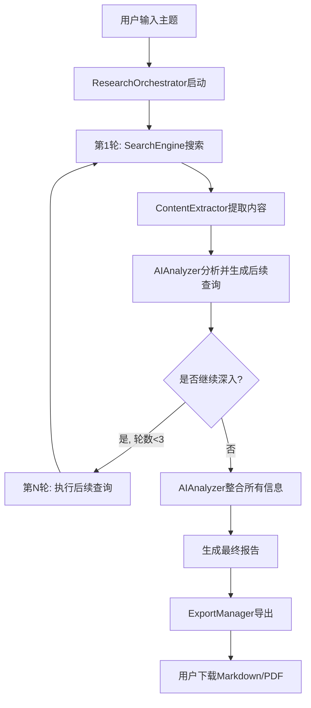

## 产品概述

一个智能深度研究工具，通过AI大模型和网络搜索API的结合，实现多轮信息检索、分析和整合。用户可以通过Web界面输入研究主题，系统自动进行多轮搜索、内容提取、智能分析，并生成结构化的研究报告。

## 核心功能

- **智能多轮搜索**: 集成DuckDuckGo/SerpAPI进行网络搜索，根据分析结果自动优化后续查询策略
- **AI内容分析**: 使用OpenAI/Claude进行内容分析、信息提取和智能整合
- **交互式界面**: Streamlit构建的Web界面，实时展示研究进度和中间结果
- **报告导出**: 支持Markdown和PDF格式导出，包含完整的引用来源
- **GitHub部署**: 完整的项目结构和文档，可直接推送到GitHub仓库

## 技术栈选择

- **开发语言**: Python 3.9+
- **Web框架**: Streamlit (快速构建交互式数据应用)
- **AI模型**: OpenAI GPT-4 / Anthropic Claude API
- **搜索引擎**: DuckDuckGo Search API (免费) / SerpAPI (备选)
- **网页解析**: BeautifulSoup4 + Requests + lxml
- **文档生成**: python-markdown, weasyprint (PDF导出)
- **环境管理**: python-dotenv
- **版本控制**: Git + GitHub

## 实现方案

### 核心实现策略

采用**模块化分层架构**，将搜索、分析、提取、编排、导出等功能解耦为独立模块，通过ResearchOrchestrator协调整个研究流程。使用Streamlit的会话状态管理研究进度，实现流式显示和用户交互。

### 关键技术决策

1. **选择DuckDuckGo作为主要搜索引擎**

- 理由: 免费、无需API密钥、支持即时搜索、适合快速原型
- 备选: SerpAPI (需付费但结果质量更高)

2. **使用Streamlit而非Flask/FastAPI**

- 理由: 快速开发、内置组件丰富、适合数据展示、无需前后端分离
- 权衡: 灵活性较低，但满足当前需求

3. **采用同步IO而非异步**

- 理由: Streamlit主要是同步框架，代码简洁易维护
- 优化: 使用多线程进行并发搜索和内容提取

4. **PDF导出使用weasyprint**

- 理由: 支持HTML到PDF转换，可复用Markdown渲染结果
- 备选: reportlab (更底层但需要更多代码)

### 性能考虑

- **搜索并发**: 使用ThreadPoolExecutor并发处理多个搜索查询和内容提取，预计可将总耗时减少60-70%
- **内容缓存**: 实现基于URL的简单缓存机制(字典存储)，避免重复请求相同URL
- **API限流**: 
- OpenAI/Claude: 每轮分析间隔1-2秒，避免触发速率限制
- 搜索API: 控制并发数量(最多5个并发)
- **增量渲染**: 使用Streamlit的st.empty()和st.spinner()实现研究进度的实时更新

### 实施细节

1. **错误处理**

- 网络请求失败: 重试3次，指数退避
- API调用失败: 降级处理，跳过当前步骤
- 内容提取失败: 使用摘要替代正文

2. **日志记录**

- 使用Python标准logging模块
- 记录级别: INFO用于流程追踪，ERROR用于异常
- 避免记录API密钥等敏感信息

3. **向后兼容**

- 环境变量使用.env文件，提供.env.example模板
- 依赖版本锁定在requirements.txt中

## 架构设计

### 系统架构

采用分层架构，从上到下分为:

- **表示层**: Streamlit UI组件
- **业务逻辑层**: ResearchOrchestrator协调器
- **服务层**: SearchEngine、AIAnalyzer、ContentExtractor独立模块
- **工具层**: ExportManager、Logger等辅助工具

数据流向: 用户输入 → ResearchOrchestrator → (SearchEngine ↔ ContentExtractor) → AIAnalyzer → ExportManager → 文件输出

### 核心流程



## 目录结构

### 目录结构总览

从零搭建的完整Deep Research项目，包含核心功能模块、配置管理、用户界面和文档。

```
deep-research/
├── app.py                      # [NEW] Streamlit应用主入口。实现用户界面布局、研究主题输入、研究流程触发、进度显示、结果展示、文件下载功能。使用st.session_state管理研究状态。
├── requirements.txt            # [NEW] Python依赖包列表。包含streamlit、openai、anthropic、duckduckgo-search、beautifulsoup4、requests、lxml、markdown、weasyprint、python-dotenv等核心依赖及其版本号。
├── .env.example               # [NEW] 环境变量配置模板。定义OPENAI_API_KEY、ANTHROPIC_API_KEY、SERP_API_KEY等API密钥占位符，指导用户配置。
├── .gitignore                 # [NEW] Git忽略文件配置。忽略.env、__pycache__、*.pyc、outputs/、.vscode/、.idea/等文件和目录。
├── README.md                  # [NEW] 项目说明文档。包含项目简介、功能特性、安装步骤、API密钥配置、使用方法、示例截图、技术栈说明、贡献指南。
├── config/
│   ├── __init__.py            # [NEW] config包初始化文件，导出Settings类。
│   └── settings.py            # [NEW] 配置管理模块。使用dotenv加载环境变量，定义API密钥、搜索参数(每轮搜索数量、最大研究轮数、并发数)、导出路径等配置项，提供单例访问。
├── core/
│   ├── __init__.py            # [NEW] core包初始化文件，导出所有核心类。
│   ├── search_engine.py       # [NEW] 搜索引擎封装模块。实现SearchEngine类，封装DuckDuckGo Search API调用，提供search(query, max_results)方法返回搜索结果列表(标题、URL、摘要)，处理API异常和重试逻辑。
│   ├── ai_analyzer.py         # [NEW] AI分析模块。实现AIAnalyzer类，封装OpenAI/Claude API调用。提供analyze_search_results()分析搜索结果并提取关键信息，generate_follow_up_queries()生成后续搜索查询，synthesize_research()整合所有信息生成最终报告。支持流式响应和Token计数。
│   ├── content_extractor.py   # [NEW] 内容提取模块。实现ContentExtractor类，使用requests获取网页HTML，BeautifulSoup解析正文，去除script、style、nav、footer等无关标签，提取清洗后的文本内容。处理编码、超时、异常情况。
│   └── research_orchestrator.py # [NEW] 研究流程编排模块。实现ResearchOrchestrator类，协调SearchEngine、ContentExtractor、AIAnalyzer的调用。执行多轮研究流程：初始搜索→内容提取→AI分析→生成后续查询→迭代(最多3轮)→最终整合。使用回调函数实时更新进度。
├── utils/
│   ├── __init__.py            # [NEW] utils包初始化文件，导出ExportManager和setup_logger。
│   ├── export_manager.py      # [NEW] 导出功能模块。实现ExportManager类，提供export_markdown()将研究结果保存为Markdown文件，export_pdf()使用weasyprint将Markdown转换为PDF。处理文件命名、路径创建、格式化输出。
│   └── logger.py              # [NEW] 日志管理模块。配置Python logging，设置日志格式(时间、级别、模块、消息)、日志级别(INFO)、输出目标(控制台和文件)。提供setup_logger()函数供各模块使用。
└── outputs/                   # [NEW] 导出文件存储目录，用于保存生成的Markdown和PDF报告文件。
    └── .gitkeep               # [NEW] 保持outputs目录在Git中被追踪的占位文件。
```

## 关键代码结构

### 1. SearchEngine接口

```python
class SearchEngine:
    def search(self, query: str, max_results: int = 10) -> List[Dict[str, str]]:
        """
        执行搜索并返回结果列表
        
        Args:
            query: 搜索查询字符串
            max_results: 最大结果数量
            
        Returns:
            List[Dict]: 每个结果包含 'title', 'url', 'snippet'
        """
        pass
```

### 2. AIAnalyzer接口

```python
class AIAnalyzer:
    def analyze_search_results(self, query: str, results: List[Dict]) -> Dict[str, Any]:
        """分析搜索结果并提取关键信息"""
        pass
    
    def generate_follow_up_queries(self, initial_query: str, analysis: Dict) -> List[str]:
        """生成后续搜索查询"""
        pass
    
    def synthesize_research(self, all_data: List[Dict]) -> str:
        """整合所有信息生成最终报告"""
        pass
```

### 3. ResearchOrchestrator核心流程

```python
class ResearchOrchestrator:
    def conduct_research(self, topic: str, max_rounds: int = 3, 
                        progress_callback: Callable = None) -> ResearchResult:
        """
        执行完整的研究流程
        
        Args:
            topic: 研究主题
            max_rounds: 最大研究轮数
            progress_callback: 进度更新回调函数
            
        Returns:
            ResearchResult: 包含最终报告、引用来源、研究路径
        """
        pass
```

### 4. 关键数据结构

```python
@dataclass
class SearchResult:
    title: str
    url: str
    snippet: str
    content: Optional[str] = None

@dataclass
class ResearchRound:
    round_number: int
    queries: List[str]
    search_results: List[SearchResult]
    analysis: Dict[str, Any]

@dataclass
class ResearchResult:
    topic: str
    final_report: str
    rounds: List[ResearchRound]
    sources: List[str]
    timestamp: datetime
```